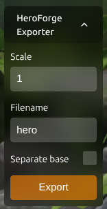

# HeroForge Exporter

A simple tool to export models as STL files from [HeroForge](https://www.heroforge.com/).

The models exported by this tool aren't as detailed as the official HeroForge downloads, but they are good enough for basic 3D printing.

## How to use

1. Open [HeroForge](https://www.heroforge.com/) in your web browser.
2. Open the browser's developer console (usually F12 or right-click and select "Inspect").
3. Copy the following code and paste it into the console:

```javascript
(() => {
  const script = document.createElement('script');
  script.src = 'https://cdn.jsdelivr.net/gh/marianocordoba/heroforge-exporter@main/dist/hfe.js';
  document.head.appendChild(script);
})();
```

4. Press Enter to execute the code.
5. A widget will appear in the bottom-left corner of the screen. Use it to export your model.



## Disclaimer

- This tool is not affiliated with or endorsed by HeroForge. Please respect HeroForge's terms of service and intellectual property rights.

- The exporter code was written by Claude Opus 4.5 so I don't really know how it works.

- Pasting the code into the console is done at your own risk. Review the code before executing it.